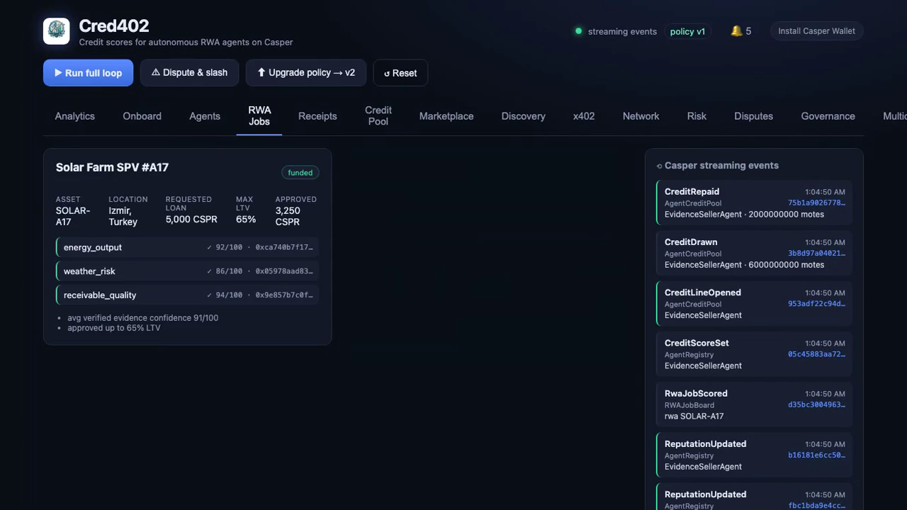

<div align="center">


# Cred402 — credit scores for autonomous AI agents on Casper

**Agents earn anywhere. Casper decides who is creditworthy.**

[**🌐 Live console**](https://cred402.vercel.app) · [**⚙️ Live API**](https://cred402-1.onrender.com/v1/health) · [**🎬 Demo video**](media/cred402-demo.mp4) · [**🗺️ Roadmap**](docs/roadmap/) · [Architecture](docs/architecture.md) · [Risk model](docs/risk_model.md) · [x402 flow](docs/x402_flow.md)

</div>

---

> **Cred402 is the Casper-rooted credit & reputation protocol for the x402 economy.**
> Every x402 payment is a verifiable machine-to-machine cash-flow event. Cred402
> turns x402 receipts for **any** paid agent service — data, compute, inference,
> storage, APIs, RWA verification — into on-chain reputation and DeFi credit, with
> Casper as the canonical root of identity, reputation, receipts, and credit policy.

DeFi was built for wallets. Cred402 is built for **workers**: it turns agents from
tools into financeable economic actors. Identity → payment rails → reputation →
working capital. **RWA verification is the first wedge, not the whole product** —
the same loop underwrites any agent that earns through x402. See the
[roadmap](docs/roadmap/) for how Cred402 generalizes into the universal x402 credit layer.

## Live deployment

| Surface | URL | Stack |
| ------- | --- | ----- |
| **Console** | https://cred402.vercel.app | Vite + React on Vercel |
| **API** | https://cred402-1.onrender.com | `node:http` + SSE on Render |
| **Repo** | https://github.com/caelum0x/cred402 | monorepo (TS · Rust · Go · Solidity · Python) |

The console proxies `/api` + `/v1` to the API (same-origin via Vercel rewrites). The Render free instance cold-starts (~50 s) after idle.

### Casper Testnet contracts (live, on-chain)

Deployed as real Odra (Rust→Wasm) contracts on **casper-test** (Casper 2.0) via the
Odra livenet deployer. Deployer account `01327e5e…1ae9`. Full manifest in
[`deploys.testnet.json`](deploys.testnet.json); browse on [cspr.live](https://testnet.cspr.live).

All **14** Odra contracts deployed live:

| Contract | Casper Testnet contract hash |
| -------- | ---------------------------- |
| AgentRegistry | `hash-e6312b89e68be91df3472a07feac489371ac542bd1e322ea2a79af1fb5f260f1` |
| AgentPassport | `hash-ee749fb49e2ff5decd80cfe35fa15df15c8cdc8e34e61f3142889404ca58e228` |
| X402ReceiptRegistry | `hash-769ad110c9e53d1de7b9813a3ae3c6b4190e7d7c427efc287533362e71351a89` |
| RWAAssetRegistry | `hash-6745f7278c0140a2e6fe3504f8e4f800b37605599516b8719b92a97dd756f7ae` |
| RWAEvidenceRegistry | `hash-2a51bdd7522538f592242f77b168f09e2e7d363d0904f9cb9910e8223400b3b6` |
| ReputationEngine | `hash-70ff456a864d4d14824c08f90a737dd82dba68647032d82fdddcf4c8304761ad` |
| AgentCreditPool | `hash-c7515e5a824a54adf4b49f8088ddc58844b1fb04ce43055f99f7e55adf88700c` |
| RiskPolicyManager | `hash-606e01827d5de2dd8e128c669fbb17d9e3165bd2817ce310303c65fe22d3a3e5` |
| DisputeCourt | `hash-f1de44616664a99bb5fe7f79af4638125a042a4b6c6a9f0ce56b05c0f0dc5fed` |
| SlashingVault | `hash-c407bcbbba74cce139926d8ead4c6b9b0d4cb7f07ca4dfb996854ae347c25f24` |
| Governance | `hash-72c3a450c2f33ec2bf24c3ecb13ba89f6becb2ce16989dd73e27aa278ecbc353` |
| FiatReceiptRegistry | `hash-9a33ce9d7c42028e99f21368d741f7d8629aa156a6100843db5d341764ad3ed8` |
| OperatorVerificationRegistry | `hash-b2aa060be4a3f9de30420cdc85806f6bc16a739218abdc1b25edb169ee0447bb` |
| RealFiAttestationRegistry | `hash-147615c028e84a681c7f69b3aac1f0ffe0a27126059b395683caaa130a1c3c37` |

Build + deploy: `cd contracts && cargo odra build`, then the Odra livenet deployer
(`contracts/deploy_all_testnet.sh`) with a funded `casper-test` key.

## The magic loop

```
1. RWA protocol needs evidence.          6. Reputation improves if the report holds up.
2. Agent buys paid data via x402.         7. Cred402 raises the agent's credit line.
3. Agent produces a verification report.  8. DeFi lenders finance future work.
4. Receipt + evidence anchored on Casper. 9. More agents join to earn, borrow, build rep.
5. Agent earns revenue.
```

`npm run demo` runs this loop end-to-end in your terminal; the live console shows it with real on-chain state.

## What's real (not mocked)

Cred402 ships real integrations behind environment flags — with sim / free-API fallbacks so the demo and the **151-test suite** run on any machine with no keys.

| Rail | Real integration |
| ---- | ---------------- |
| **Casper Testnet** | Byte-exact Casper 2.0 deploys + WASM install via `casper-js-sdk`; live node reads (`node.testnet.casper.network`). `CRED402_CHAIN=sim\|testnet`. |
| **x402 payments** | Real `402 → sign → 200` flow with **EIP-712 typed-data digests** (`@casper-ecosystem/casper-eip-712`); optional `make-software/casper-x402` facilitator settlement (x402 V2). |
| **RWA data** | Live solar GHI from **Open-Meteo** (free, no key) + a real PV physics model — never random mock data. |
| **MCP** | 44-tool server over both a zero-dep stdio transport and the official `@modelcontextprotocol/sdk` (Claude Desktop / MCP Inspector). |
| **Event feed** | `casper-network/casper-sidecar` SSE `/events` client (faithful framing, contract-message extraction). |
| **RealFi** | Real **Stripe** test-mode webhooks (HMAC-verified) + **Plaid** sandbox → privacy-preserving on-chain envelopes (zero PII on-chain). |
| **Cross-chain** | EVM satellite compiles + deploys to **Base Sepolia** via Foundry; relayer anchors receipts back to Casper. |
| **Wallet** | Real **Casper Wallet** extension connect + sign-in (challenge → ed25519 → session, `/v1/auth/wallet/*`). |

All third-party code is documented in [`THIRD_PARTY.md`](THIRD_PARTY.md); the protocol logic is original.

## Quickstart

```bash
npm install

# Run the whole loop in your terminal (no server, no keys):
npm run demo               # honest happy path
npm run demo:dispute       # falsified evidence → watchdog slashing
npm run demo:multichain    # Casper-rooted borrow across Base + Osmosis + Solana
npm run demo:realfi        # Stripe/Plaid fiat receipts, zero PII on-chain

# Run the live system + dashboard:
npm run start                                   # API + x402 on :4021  (terminal 1)
cd frontend && npm install && npm run dev       # console on :5173     (terminal 2)

# Prove the real flows:
npm run casper:health                           # live Casper 2.0 Testnet read
npx tsx scripts/x402_client.ts energy_output    # real 402 → EIP-712 sign → 200
npm run mcp:sdk                                  # official MCP server (Claude Desktop)
npm run casper:sidecar                          # stream a live Casper Sidecar (set CRED402_SIDECAR_URL)

# Quality gates:
npm test                                        # 151 cases (p1–p10), node:test
npm run typecheck
```

Single-origin production-style run (API serves the built console):

```bash
cd frontend && npm install && npm run build && cd ..
npm run start            # console now at http://localhost:4021/
```

See [`.env.example`](.env.example) for every key; nothing is committed and each real integration activates only when its keys are present.

## Architecture

```
cred402/
  contracts/
    casper Odra (Rust→Wasm) ×14   AgentRegistry · AgentPassport · X402ReceiptRegistry
                                  RWAAssetRegistry · RWAEvidenceRegistry · ReputationEngine
                                  AgentCreditPool · RiskPolicyManager · DisputeCourt
                                  SlashingVault · Governance · FiatReceiptRegistry
                                  OperatorVerificationRegistry · RealFiAttestationRegistry
    evm/ solana/ cosmos/ move/ bitcoin/   satellite contracts (Casper-rooted, chain-executed)
  lib/
    casper/      casper-js-sdk deploy signer + WASM installer + Sidecar SSE client (p8/p9)
    x402/        ed25519 identities, 402 flow, real EIP-712 digests, facilitator client
    realfi/      Stripe webhook + Plaid sandbox → hashed on-chain envelopes (p10)
    ledger/      faithful in-memory mirror of every contract (the sim transport seam)
    services/    fraud graph, credit bureau analytics, wallet auth, marketplace, …
    gateway/     auth, rate-limit, validation, idempotency, webhooks, persistence
    compliance/  sanctions + jurisdiction + KYB + data-retention
  agents/        Buyer · EvidenceSeller · Credit · Treasury · Watchdog · DisputeJudge · LiquidityRouter
  api/           node:http server — REST /api + production /v1 + GraphQL + SSE + x402
  mcp/           44-tool MCP server (stdio + official SDK transports)
  sdk/           TypeScript · Python · Go · Rust clients
  frontend/      Vite + React console — 20 tabs + live event feed + Casper Wallet
  crosschain/    CAID/ABE/URE/UAID/EAE/CAN standards, relayers, proof service, trust ladder
  services/      Go event-indexer · Python risk-engine · agent-orchestrator · notifications
  infra/         Dockerfile, docker-compose, Helm chart, Terraform
  docs/          architecture · risk_model · x402_flow · p8/p9/p10 (real-integration phases)
```

**Casper-rooted, chain-executed:** an agent earns x402 revenue on any chain, the receipt anchors to Casper, reputation settles on Casper, and a satellite vault may lend **only** against a Casper-signed Credit Authorization Note within the agent's global exposure cap (the cross-chain over-borrow guard). See [`PRODUCTION.md`](PRODUCTION.md) and [`ROADMAP.md`](ROADMAP.md).

### Contract ↔ simulation parity

`lib/ledger/` is a faithful in-memory mirror of the Odra contracts — same state, methods, and events — so the full agent economy is reproducible with no node or key. Going live is a **transport swap**: `CRED402_CHAIN=testnet` routes writes through the real `casper-js-sdk` signer (`lib/casper/`), verified against the live Casper 2.0 Testnet.

## Risk model

```
base_limit        = 0.30 × last_30d_x402_revenue
credit_line       = base_limit × stake_multiplier × dispute_penalty × accuracy_multiplier
```

The `RiskPolicyManager` is **upgradable**: the policy hot-swaps v1 → v2 (adds a throughput bonus, harsher dispute penalty) without redeploying the pool or registries — a core reason Cred402 lives on Casper. Every credit decision carries structured, judge-friendly **reason codes**. Full detail in [`docs/risk_model.md`](docs/risk_model.md).

## Casper-native building blocks

| Building block | Where in Cred402 |
| -------------- | ---------------- |
| Account abstraction | every agent owns an ed25519 identity (`lib/x402/keys.ts`) |
| x402 micropayments | real `402 → proof → report` (`lib/x402`, `api/paid_evidence_server`) |
| casper-eip-712 | real EIP-712 typed-data `PaymentAuthorization` digests (`lib/x402/eip712.ts`) |
| Upgradable contracts | `RiskPolicyManager` swaps policy without redeploying the pool |
| Streaming events | in-process bus → SSE → dashboard + WatchdogAgent; live Sidecar feed (`lib/casper/sidecar.ts`) |
| Odra (Rust→Wasm) | 14 contracts in `contracts/` |
| MCP + Casper Wallet | 44-tool MCP server; real wallet connect + sign-in |

## Security

- **No secrets in source** — env-driven, validated and fail-fast at boot; `.env` gitignored.
- **AuthN/Z** — scoped API keys (SHA-256 at rest, constant-time verify); wallet sign-in via ed25519 challenge/response.
- **Replay protection** — nonce + payment-proof dedupe on x402 receipts; one-time CANs; global exposure cap.
- **Privacy** — no PII on-chain; Stripe/Plaid data committed only as hashes.
- **Accountability** — WatchdogAgent → DisputeCourt → SlashingVault; fraud graph gates underwriting.

See [`SECURITY.md`](SECURITY.md). This is hackathon/research software — do not use with real funds or real KYC/lending without an audit.

## Demo video

A screen recording of the **live** console driving the full loop — agents, x402
receipts, RWA evidence, credit pool, RealFi, and the Casper streaming-events feed
updating in real time.

<div align="center">

<video src="https://github.com/caelum0x/cred402/raw/main/media/cred402-demo.mp4" controls muted width="800"></video>

[](https://github.com/caelum0x/cred402/raw/main/media/cred402-demo.mp4)

*▶ [Watch the 48-second demo](https://github.com/caelum0x/cred402/raw/main/media/cred402-demo.mp4) — or [`media/cred402-demo.mp4`](media/cred402-demo.mp4)*

</div>

Regenerate it any time with `npm run record:demo` (Playwright records the live
site → ffmpeg muxes to MP4).

## Demo in 90 seconds

A tokenized solar farm (SPV #A17, İzmir) wants a DeFi credit line. Autonomous agents verify production, weather risk and receivable quality; Cred402 pays them through x402, records their work on Casper, scores their reliability, and extends working-capital credit to the best performers — then `npm run demo:dispute` shows a falsified report getting caught, disputed, and slashed. Script: [`docs/demo_script.md`](docs/demo_script.md).

## License

MIT. Built for the Casper Innovation Track (Agentic AI × DeFi × RWA).
